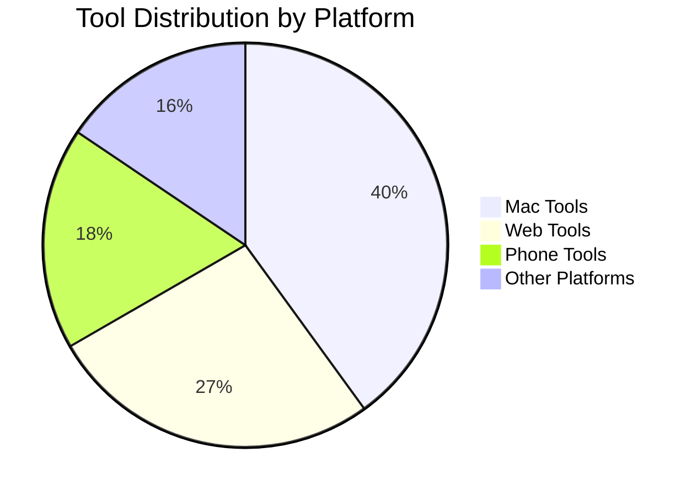

# Awesome Tools Collection 🛠️

> Carefully curated productivity tools collection with **450+** practical tools, detailed tutorials, and real-world usage tips

[](LICENSE)
[](CONTRIBUTING.md)
[](https://github.com/Michael/AwesomeTools/stargazers)
[](README_ZH.md)

🌍 **Languages**
- [English](README.md)
- [中文](README_ZH.md)

---

## ⭐ Featured Tools

Hand-picked essentials that I use daily:

### 🖥️ Mac Essentials

1. [Alfred](https://www.alfredapp.com/) 🔍 - Search and workflow powerhouse
2. [Moom](https://manytricks.com/moom/) 🪟 - Window management magic
3. [Paste](http://pasteapp.me/) 📋 - Clipboard manager with history
4. [iTerm2](https://www.iterm2.com/) 💻 - Ultimate terminal experience
5. [BetterTouchTool](http://xclient.info/s/bettertouchtool.html) 👆 - Trackpad gesture enhancement
6. [DaisyDisk](https://daisydiskapp.com/) 💾 - Disk space visualization
7. [OhMyZsh](https://github.com/robbyrussell/oh-my-zsh) ⚙️ - Best Zsh framework

### 📱 Phone Productivity

1. [WorkFlow](https://workflow.is/) 🔄 - iOS automation
2. [Shadowrocket](https://itunes.apple.com/hk/app/shadowrocket/id932747118?mt=8) 🚀 - Network proxy tool
3. [微信读书](https://weread.qq.com/) 📖 - Social reading app by Tencent
4. [IFTTT](https://ifttt.com/discover) ⚙️ - Automation trigger tool
5. [Pin](https://itunes.apple.com/cn/app/pin-%E5%89%AA%E8%B4%B4%E6%9D%BF%E6%89%A9%E5%B1%95/id1039643846?mt=8) 📌 - Clipboard extension

### 👨‍💻 Development Essentials

1. [VS Code](https://code.visualstudio.com/) 💻 - Powerful code editor
2. [GitKraken](https://app.gitkraken.com) 🐙 - Best Git GUI for Mac
3. [Postman](https://app.getpostman.com/dashboard) 📬 - API management tool
4. [Charles](https://www.charlesproxy.com/) 🦋 - HTTP debugging proxy
5. [Dash](https://kapeli.com/dash) 📚 - API documentation browser

---

## 📊 At a Glance

- 📝 **450+** tools in main collection
- 📄 **31** detailed tutorials
- 💡 **10** tip guides
- 🎯 **9** major categories
- 🔄 **Weekly** updates

---

## 🚀 Quick Start

### By Platform

- [📋 **AwesomeTools List** (450+ tools)](AwesomeTools清单.md) - Complete tool collection
- [🖥️ Mac Tools](AwesomeTools清单.md#-mac-工具) - macOS productivity boosters
- [📱 Phone Tools](AwesomeTools清单.md#-phone-手机工具) - iOS automation utilities
- [🌐 Web Tools](AwesomeTools清单.md#-web-工具) - Browser extensions & web apps

### By Scenario

- 💻 **Developer** → [Dev Tools](Awesome效率神器/开发工具/)
- 🎨 **Designer** → [Design Resources](docs/categories/design.md)
- ⚡ **Productivity** → [Efficiency Tools](Awesome效率神器/效率工具/)

---

## 📁 Repository Structure

```
AwesomeTools/
├── AwesomeTools清单.md     # Main list (450+ tools) ⭐
├── Awesome效率神器/         # Detailed tutorials (31 files)
│   ├── 开发工具/           # Development tools
│   └── 效率工具/           # Productivity tools
├── 电脑设备技巧/            # Device tips (10 files)
│   ├── Mac相关问题.md      # Mac tips
│   ├── Win相关问题.md      # Windows tips
│   └── iPhone相关问题.md   # iOS tips
├── docs/                    # Category indexes
│   └── categories/
└── README.md               # This file
```

---

## 🌟 Project Highlights

1. ✅ **Carefully Curated** - Every tool has detailed descriptions and real usage experience
2. ✅ **Battle-Tested** - Based on actual daily use, not just random collections
3. ✅ **Continuously Updated** - Regular additions and improvements
4. ✅ **Well-Organized** - Platform-based categorization for easy discovery

---

## 🗂️ Tool Categories

### Development Tools
- [Code Editors](docs/categories/development.md#代码编辑器) - VS Code, Sublime, etc.
- [Version Control](docs/categories/development.md#版本控制) - Git clients and workflows
- [Command Line](docs/categories/development.md#命令行工具) - Terminal enhancements
- [API Tools](docs/categories/development.md#api-工具) - Postman, Charles, etc.

### Design Tools
- [UI/UX Design](docs/categories/design.md#uiux-设计) - Figma, Sketch, Adobe XD
- [Prototype Design](docs/categories/design.md#原型设计) - Design collaboration tools
- [Graphic Design](docs/categories/design.md#图形设计) - Image editing and creation

### Productivity Tools
- [Note Taking](docs/categories/productivity.md#笔记应用) - Evernote, Notion, Obsidian
- [Task Management](docs/categories/productivity.md#任务管理) - Todo apps and GTD tools
- [Automation](docs/categories/productivity.md#自动化工具) - Workflow automation

### System Tools
- [System Optimization](docs/categories/system.md#系统优化) - Cleanup and maintenance
- [File Management](docs/categories/system.md#文件管理) - Finder enhancements
- [Window Management](AwesomeTools清单.md#🧹-系统清理与优化) - Moom, BetterTouchTool

### Network Tools
- [VPN & Proxy](docs/categories/network.md#vpn-与代理) - Shadowrocket, Surge
- [Network Monitoring](docs/categories/network.md#网络监控) - Charles, Wireshark

### Multimedia Tools
- [Image Processing](docs/categories/media.md#图像处理) - Image editors and converters
- [Video Editing](docs/categories/media.md#视频编辑) - Video tools and downloaders

### Data Science
- [Data Analysis](docs/categories/datascience.md#数据分析) - Python, R tools
- [Visualization](docs/categories/datascience.md#数据可视化) - Chart and graph tools

### Security Tools
- [Password Management](docs/categories/security.md#密码管理) - 1Password, LastPass
- [Encryption](docs/categories/security.md#加密工具) - Security utilities

### Mobile Development
- [iOS Development](docs/categories/mobiledev.md#ios-开发) - iOS dev tools
- [Android Development](docs/categories/mobiledev.md#android-开发) - Android dev tools

### Game Development
- [Game Engines](docs/categories/gamedev.md#游戏引擎) - Unity, Unreal
- [Game Assets](docs/categories/gamedev.md#游戏资源) - Graphics and audio

---

## 🔍 Featured Topics

### Chart Tools
- [图表工具合集](AwesomeTools清单.md#-图表工具) - Data visualization tools
- [Mind Mapping](AwesomeTools清单.md#-图表工具) - markmap, XMind, etc.

### Task Management
- [GTD Tools](AwesomeTools清单.md#-gtd-任务管理) - Getting Things Done apps
- [Project Management](Awesome效率神器/效率工具/) - Team collaboration tools

### Fitness & Health
- [Workout Apps](AwesomeTools清单.md#-bodybuilding-健身) - Fitness tracking tools

---

## 📚 Additional Resources

- [Hardware Recommendations](AwesomeTools清单.md#-hardware-硬件) - Keyboards, mice, monitors
- [Learning Resources](AwesomeTools清单.md#-resources-参考资料) - Tutorials and documentation
- [Mac Tips](电脑设备技巧/Mac相关问题.md) - macOS tips and tricks
- [Windows Tips](电脑设备技巧/Win相关问题.md) - Windows productivity tips
- [iOS Tips](电脑设备技巧/iPhone相关问题.md) - iPhone and iPad tips

---

## 📊 Statistics



---

## 🤝 Contributing

Contributions are welcome! Please feel free to submit a Pull Request.

1. Fork the repository
2. Create your feature branch (`git checkout -b feature/AmazingTool`)
3. Commit your changes (`git commit -m 'Add some AmazingTool'`)
4. Push to the branch (`git push origin feature/AmazingTool`)
5. Open a Pull Request

See [CONTRIBUTING.md](CONTRIBUTING.md) for more details.

---

## 📜 License

This project is licensed under the MIT License - see the [LICENSE](LICENSE) file for details.

---

## 🙏 Acknowledgments

- Thanks to all contributors who have helped build this collection
- Inspired by [awesome](https://github.com/sindresorhus/awesome) and [awesome-mac](https://github.com/jaywcjlove/awesome-mac)
- Special thanks to the open-source community for creating these amazing tools

---

<div align="center">

**⭐ If you find this helpful, please consider giving it a star! ⭐**

Made with ❤️ by [Michael](https://github.com/Michael)

</div>
