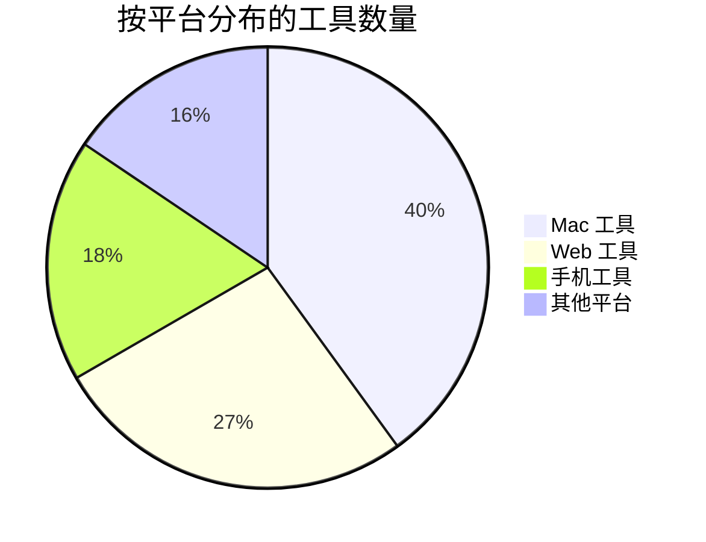

# 优秀工具集合 🛠️

> 精心策划的生产力工具合集，包含 **450+** 实用工具、详细教程和真实使用技巧

[](LICENSE)
[](CONTRIBUTING.md)
[](https://github.com/Michael/AwesomeTools/stargazers)
[](README.md)

🌍 **多语言支持**
- [English](README.md)
- [中文](README_ZH.md)

---

## ⭐ 精选推荐

日常使用的高频必备工具：

### 🖥️ Mac 必备

1. [Alfred](https://www.alfredapp.com/) 🔍 - 搜索和工作流神器
2. [Moom](https://manytricks.com/moom/) 🪟 - 窗口管理神器
3. [Paste](http://pasteapp.me/) 📋 - 剪贴板历史管理器
4. [iTerm2](https://www.iterm2.com/) 💻 - 终极终端体验
5. [BetterTouchTool](http://xclient.info/s/bettertouchtool.html) 👆 - 触控板手势增强
6. [DaisyDisk](https://daisydiskapp.com/) 💾 - 磁盘空间可视化
7. [OhMyZsh](https://github.com/robbyrussell/oh-my-zsh) ⚙️ - 最佳 Zsh 框架

### 📱 手机效率

1. [WorkFlow](https://workflow.is/) 🔄 - iOS 自动化工具
2. [Shadowrocket](https://itunes.apple.com/hk/app/shadowrocket/id932747118?mt=8) 🚀 - 网络代理工具
3. [微信读书](https://weread.qq.com/) 📖 - 腾讯社交读书应用
4. [IFTTT](https://ifttt.com/discover) ⚙️ - 条件触发自动化工具
5. [Pin](https://itunes.apple.com/cn/app/pin-%E5%89%AA%E8%B4%B4%E6%9D%BF%E6%89%A9%E5%B1%95/id1039643846?mt=8) 📌 - 剪贴板扩展

### 👨‍💻 开发必备

1. [VS Code](https://code.visualstudio.com/) 💻 - 强大的代码编辑器
2. [GitKraken](https://app.gitkraken.com) 🐙 - Mac 上最好用的 Git GUI
3. [Postman](https://app.getpostman.com/dashboard) 📬 - API 请求管理工具
4. [Charles](https://www.charlesproxy.com/) 🦋 - HTTP 抓包调试工具
5. [Dash](https://kapeli.com/dash) 📚 - API 文档查看工具

---

## 📊 一览

- 📝 **450+** 主清单工具
- 📄 **31** 详细教程文档
- 💡 **10** 技巧指南
- 🎯 **9** 大分类
- 🔄 **每周**更新

---

## 🚀 快速开始

### 按平台浏览

- [📋 **AwesomeTools 清单** (450+ 工具)](AwesomeTools清单.md) - 完整工具集合 ⭐
- [🖥️ Mac 工具](AwesomeTools清单.md#-mac-工具) - macOS 生产力工具
- [📱 手机工具](AwesomeTools清单.md#-phone-手机工具) - iOS 自动化工具
- [🌐 Web 工具](AwesomeTools清单.md#-web-工具) - 浏览器扩展和 Web 应用

### 按场景浏览

- 💻 **开发者** → [开发工具](Awesome效率神器/开发工具/)
- 🎨 **设计师** → [设计资源](docs/categories/design.md)
- ⚡ **效率达人** → [效率工具](Awesome效率神器/效率工具/)

---

## 📁 仓库结构

```
AwesomeTools/
├── AwesomeTools清单.md     # 主清单 (450+ 工具) ⭐
├── Awesome效率神器/         # 详细教程 (31 个文件)
│   ├── 开发工具/           # 开发工具
│   └── 效率工具/           # 效率工具
├── 电脑设备技巧/            # 设备技巧 (10 个文件)
│   ├── Mac相关问题.md      # Mac 技巧
│   ├── Win相关问题.md      # Windows 技巧
│   └── iPhone相关问题.md   # iOS 技巧
├── docs/                    # 分类索引
│   └── categories/
└── README.md               # 本文件
```

---

## 🌟 项目亮点

1. ✅ **精心策划** - 每个工具都有详细描述和真实使用经验
2. ✅ **实战验证** - 基于日常实际使用，而非随机收集
3. ✅ **持续更新** - 定期添加和改进
4. ✅ **结构清晰** - 按平台分类，易于发现

---

## 🗂️ 工具分类

### 开发工具
- [代码编辑器](docs/categories/development.md#代码编辑器) - VS Code、Sublime 等
- [版本控制](docs/categories/development.md#版本控制) - Git 客户端和工作流
- [命令行工具](docs/categories/development.md#命令行工具) - 终端增强工具
- [API 工具](docs/categories/development.md#api-工具) - Postman、Charles 等

### 设计工具
- [UI/UX 设计](docs/categories/design.md#uiux-设计) - Figma、Sketch、Adobe XD
- [原型设计](docs/categories/design.md#原型设计) - 设计协作工具
- [图形设计](docs/categories/design.md#图形设计) - 图像编辑和创作

### 效率工具
- [笔记应用](docs/categories/productivity.md#笔记应用) - Evernote、Notion、Obsidian
- [任务管理](docs/categories/productivity.md#任务管理) - 待办应用和 GTD 工具
- [自动化工具](docs/categories/productivity.md#自动化工具) - 工作流自动化

### 系统工具
- [系统优化](docs/categories/system.md#系统优化) - 清理和维护
- [文件管理](docs/categories/system.md#文件管理) - Finder 增强
- [窗口管理](AwesomeTools清单.md#🧹-系统清理与优化) - Moom、BetterTouchTool

### 网络工具
- [VPN 与代理](docs/categories/network.md#vpn-与代理) - Shadowrocket、Surge
- [网络监控](docs/categories/network.md#网络监控) - Charles、Wireshark

### 多媒体工具
- [图像处理](docs/categories/media.md#图像处理) - 图像编辑器和转换器
- [视频编辑](docs/categories/media.md#视频编辑) - 视频工具和下载器

### 数据科学
- [数据分析](docs/categories/datascience.md#数据分析) - Python、R 工具
- [数据可视化](docs/categories/datascience.md#数据可视化) - 图表和图形工具

### 安全工具
- [密码管理](docs/categories/security.md#密码管理) - 1Password、LastPass
- [加密工具](docs/categories/security.md#加密工具) - 安全工具

### 移动开发
- [iOS 开发](docs/categories/mobiledev.md#ios-开发) - iOS 开发工具
- [Android 开发](docs/categories/mobiledev.md#android-开发) - Android 开发工具

### 游戏开发
- [游戏引擎](docs/categories/gamedev.md#游戏引擎) - Unity、Unreal
- [游戏资源](docs/categories/gamedev.md#游戏资源) - 图形和音频

---

## 🔍 精选专题

### 图表工具
- [图表工具合集](AwesomeTools清单.md#-图表工具) - 数据可视化工具
- [思维导图](AwesomeTools清单.md#-图表工具) - markmap、XMind 等

### 任务管理
- [GTD 工具](AwesomeTools清单.md#-gtd-任务管理) - Getting Things Done 应用
- [项目管理](Awesome效率神器/效率工具/) - 团队协作工具

### 健身与健康
- [健身应用](AwesomeTools清单.md#-bodybuilding-健身) - 健身追踪工具

---

## 📚 更多资源

- [硬件推荐](AwesomeTools清单.md#-hardware-硬件) - 键盘、鼠标、显示器
- [学习资源](AwesomeTools清单.md#-resources-参考资料) - 教程和文档
- [Mac 技巧](电脑设备技巧/Mac相关问题.md) - macOS 技巧
- [Windows 技巧](电脑设备技巧/Win相关问题.md) - Windows 效率技巧
- [iOS 技巧](电脑设备技巧/iPhone相关问题.md) - iPhone 和 iPad 技巧

---

## 📊 统计数据



---

## 🤝 贡献

欢迎贡献！请随时提交 Pull Request。

1. Fork 本仓库
2. 创建您的特性分支 (`git checkout -b feature/AmazingTool`)
3. 提交您的更改 (`git commit -m 'Add some AmazingTool'`)
4. 推送到分支 (`git push origin feature/AmazingTool`)
5. 开启一个 Pull Request

详见 [CONTRIBUTING.md](CONTRIBUTING.md)

### 行为准则

请确保阅读并遵守我们的 [行为准则](CODE_OF_CONDUCT.md)。

---

## 📜 许可证

本项目采用 MIT 许可证 - 详见 [LICENSE](LICENSE) 文件

---

## 🙏 致谢

- 感谢所有帮助构建此集合的贡献者
- 灵感来源于 [awesome](https://github.com/sindresorhus/awesome) 和 [awesome-mac](https://github.com/jaywcjlove/awesome-mac)
- 特别感谢开源社区创建了这些精彩工具

---

<div align="center">

**⭐ 如果觉得有用，请给个 Star！⭐**

由 [Michael](https://github.com/Michael) 用 ❤️ 制作

</div>
