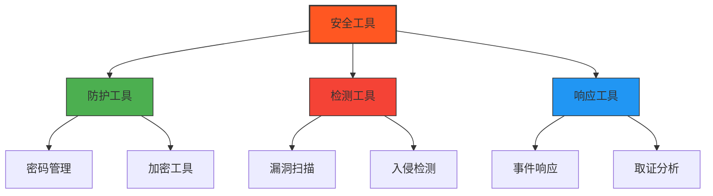
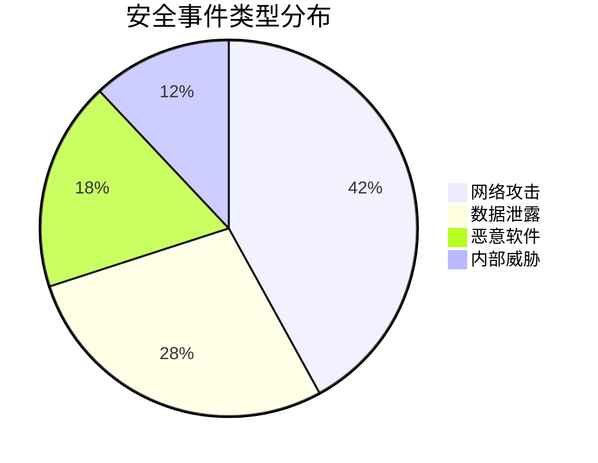
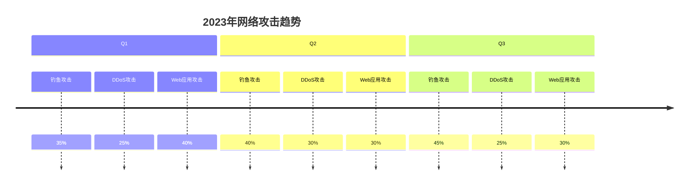
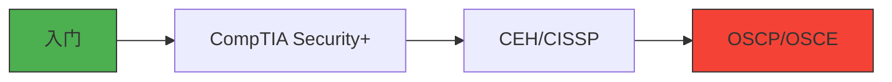

# 🔒 安全工具

> 最后更新: 2023-10-16

## 📊 安全态势概览

## 目录

- [密码管理](#密码管理)
- [加密工具](#加密工具)
- [网络安全](#网络安全)
- [渗透测试](#渗透测试)
- [隐私保护](#隐私保护)
- [取证工具](#取证工具)
- [端点安全](#端点安全)
- [选择指南](#选择指南)
- [学习资源](#学习资源)
- [更新日志](#更新日志)

## 🔑 密码管理

密码管理是网络安全的第一道防线。以下是推荐的密码管理工具：

| 工具 | 描述 | 安全特性 | 平台 | 价格 |
|------|------|---------|------|------|
| [Bitwarden](https://bitwarden.com/) | 端到端加密密码管理器 | ✅ 2FA 🔐 零知识加密 📱 跨平台同步 | Windows, macOS, Linux, Web | 免费/付费 |
| [1Password](https://1password.com/) | 企业级密码管理 | 🛡️ 旅行模式 🔑 主密码保护 👥 团队协作 | Windows, macOS, Linux, Web | 付费 |
| [KeePass](https://keepass.info/) | 开源本地密码管理 | 🔓 本地存储 🔌 插件扩展 🔒 文件加密 | Windows, macOS, Linux | 免费 |
| [LastPass](https://www.lastpass.com/) | 企业级密码管理 | 👁️ 密码健康检查 🔐 安全共享 📊 管理控制台 | Windows, macOS, Linux, Web | 免费/付费 |

## 🔐 加密工具

加密工具可以保护您的数据安全，防止未授权访问。以下是推荐的加密工具：

| 工具 | 加密类型 | 主要特点 | 适用场景 | 价格 |
|------|---------|---------|---------|------|
| [VeraCrypt](https://www.veracrypt.fr/) | 全盘/容器加密 | 🔐 AES-256 加密 🔄 隐藏卷 📦 便携模式 | 敏感数据存储 系统加密 | 免费 |
| [GnuPG](https://gnupg.org/) | 非对称加密 | 🔑 PGP 标准 📧 电子邮件加密 🔏 数字签名 | 安全通信 代码签名 | 免费 |
| [Cryptomator](https://cryptomator.org/) | 云存储加密 | ☁️ 云存储集成 📱 移动端支持 🔒 透明加密 | 云文件保护 | 免费/付费 |
| [AESCrypt](https://www.aescrypt.com/) | 文件加密 | 🎯 简单易用 🔄 批量处理 🔑 强密码保护 | 文件共享 邮件附件 | 免费 |

## 🌐 网络安全

### 网络攻击趋势

| 工具 | 类型 | 主要功能 | 适用场景 | 价格 |
|------|------|---------|---------|------|
| [Wireshark](https://www.wireshark.org/) | 协议分析 | 🕵️ 深度包检测 📊 流量分析 🔍 实时捕获 | 网络排错 安全分析 | 免费 |
| [Nmap](https://nmap.org/) | 端口扫描 | 🎯 主机发现 🔍 服务识别 🛡️ 漏洞检测 | 安全审计 网络映射 | 免费 |
| [OpenVAS](https://www.openvas.org/) | 漏洞扫描 | 🎯 全面扫描 📝 报告生成 🔄 持续监控 | 合规检查 安全评估 | 免费 |
| [Snort](https://www.snort.org/) | IDS/IPS | 🚨 实时检测 🛡️ 威胁防护 📊 流量分析 | 网络监控 入侵防御 | 免费 |

## 🎯 渗透测试

### 渗透测试流程

| 工具 | 类型 | 主要功能 | 适用阶段 | 价格 |
|------|------|---------|---------|------|
| [Kali Linux](https://www.kali.org/) | 渗透测试系统 | 🛠️ 600+ 安全工具 📱 移动端支持 🔧 自定义构建 | 完整测试流程 | 免费 |
| [Metasploit](https://www.metasploit.com/) | 渗透框架 | 💥 漏洞利用 🔍 漏洞验证 📊 报告生成 | 漏洞利用 后渗透 | 免费/付费 |
| [Burp Suite](https://portswigger.net/burp) | Web 安全测试 | 🕸️ 代理拦截 🔍 漏洞扫描 🔧 扩展开发 | Web 应用测试 | 社区版免费 |
| [OWASP ZAP](https://www.zaproxy.org/) | Web 应用扫描 | 🎯 自动化扫描 🛡️ 主动/被动扫描 📝 API 测试 | Web 安全评估 | 免费 |

## 🕵️ 隐私保护

在数字时代，保护个人隐私变得尤为重要。以下工具可以帮助您保护在线隐私：

| 工具 | 保护内容 | 主要特点 | 适用场景 | 价格 |
|------|---------|---------|---------|------|
| [Tor Browser](https://www.torproject.org/) | 网络匿名 | 🌐 多层加密 🚫 防跟踪 🔄 流量中继 | 隐私浏览 审查规避 | 免费 |
| [ProtonMail](https://protonmail.com/) | 电子邮件 | 🔐 端到端加密 📧 自毁邮件 🔑 PGP 集成 | 安全通信 企业邮件 | 免费/付费 |
| [Signal](https://signal.org/) | 即时通讯 | 📱 加密消息/通话 ⏱️ 阅后即焚 🔒 开源验证 | 私密通讯 团队协作 | 免费 |
| [Tails OS](https://tails.boum.org/) | 操作系统 | 🚀 实时系统 💾 不留痕迹 🔗 Tor 网络 | 安全环境 敏感操作 | 免费 |

## 🔍 数字取证

数字取证是调查和收集电子证据的过程。以下是常用的数字取证工具：

| 工具 | 类型 | 主要功能 | 适用场景 | 价格 |
|------|------|---------|---------|------|
| [Autopsy](https://www.autopsy.com/) | 数字取证平台 | 🔍 文件恢复 📱 移动设备分析 📊 时间线分析 | 法律调查 事件响应 | 免费/付费 |
| [Wireshark](https://www.wireshark.org/) | 网络取证 | 🌐 实时捕获 📡 协议分析 🔍 深度包检测 | 网络入侵分析 | 免费 |
| [Volatility](https://www.volatilityfoundation.org/) | 内存取证 | 💾 内存转储分析 🛡️ 恶意软件检测 🔑 密码提取 | 内存取证 恶意软件分析 | 免费 |
| [FTK Imager](https://www.exterro.com/ftk-imager) | 磁盘映像 | 💿 创建磁盘映像 🔎 文件恢复 📝 哈希验证 | 证据收集 数据恢复 | 免费 |

## 🖥️ 端点安全

端点安全保护设备免受各种威胁。以下是推荐的端点安全解决方案：

| 解决方案 | 保护层级 | 主要功能 | 适用场景 | 价格 |
|---------|---------|---------|---------|------|
| [Windows Defender](https://www.microsoft.com/en-us/windows/comprehensive-security) | 基础防护 | 🛡️ 实时保护 🔍 病毒扫描 🌐 防火墙 | 个人用户 小型企业 | 免费 |
| [Malwarebytes](https://www.malwarebytes.com/) | 高级防护 | 🚫 勒索软件防护 🛡️ 漏洞防护 🌐 网页防护 | 家庭用户 专业用户 | 免费/付费 |
| [CrowdStrike](https://www.crowdstrike.com/) | 企业级 | 🎯 EDR 功能 🔍 威胁追踪 🤖 AI 防护 | 企业环境 | 付费 |
| [Sophos Home](https://home.sophos.com/) | 家庭/小型企业 | 👪 家长控制 🔒 隐私保护 📱 远程管理 | 家庭用户 远程工作者 | 免费/付费 |
| [CrowdStrike](https://www.crowdstrike.com/) | 端点检测和响应 | 跨平台 | 否 | 付费 |

## 🛡️ 安全最佳实践

### 分层防御策略
有效的安全防护需要多层次的方法：

### 关键安全措施

#### 1. 密码管理
- 🔑 使用强密码（至少12个字符，包含大小写、数字和符号）
- 🔄 为每个账户使用唯一密码
- 📱 使用密码管理器（如 Bitwarden 或 1Password）
- 🔄 定期更新重要账户的密码

#### 2. 软件更新
- 🔄 及时安装系统和应用更新
- 🛡️ 启用自动更新功能
- 📱 保持移动设备系统为最新版本

#### 3. 数据备份
- 💾 实施 3-2-1 备份策略：
  - 3 份数据副本
  - 2 种不同介质
  - 1 份异地备份
- 🔄 定期测试备份的完整性

#### 4. 网络安全
- 🔒 使用 VPN 保护公共 Wi-Fi 连接
- 🚫 避免使用不安全的公共网络进行敏感操作
- 🌐 使用 HTTPS Everywhere 等浏览器扩展

## 🎯 工具选择指南

### 评估矩阵
| 评估维度 | 个人用户 | 中小型企业 | 大型企业 |
|---------|---------|-----------|----------|
| 预算 | 免费/低价 | 中等预算 | 企业级预算 |
| 易用性 | ⭐⭐⭐⭐⭐ | ⭐⭐⭐⭐ | ⭐⭐⭐ |
| 功能需求 | 基础防护 | 高级功能 | 全面解决方案 |
| 扩展性 | 有限 | 中等 | 高度可扩展 |

### 选择步骤
1. **需求分析**
   - 确定保护对象（设备、数据、网络等）
   - 评估潜在威胁和风险
   - 确定合规性要求

2. **功能匹配**
   - 列出必备功能
   - 考虑集成需求
   - 评估报告和分析能力

3. **成本效益分析**
   - 比较许可模式（订阅/永久）
   - 计算总拥有成本（TCO）
   - 评估投资回报率（ROI）

4. **概念验证**
   - 测试关键功能
   - 评估性能影响
   - 验证易用性

## 📈 安全趋势与未来展望

### 2023-2025 年安全趋势

#### 主要威胁
- 供应链攻击持续增加
- 零日漏洞利用更加普遍
- AI 驱动的攻击日益增多

#### 防御技术
- 零信任架构成为标准
- SASE 架构广泛采用
- AI 安全防御技术成熟

### 新兴技术影响
- **AI 与机器学习**：威胁检测和响应的自动化
- **量子计算**：对现有加密算法的挑战
- **5G 网络**：新的攻击面和防护需求
- **物联网安全**：设备认证和通信加密

## 📚 学习资源

### 在线课程
| 平台 | 课程名称 | 难度 | 链接 |
|------|---------|------|------|
| Coursera | 网络安全基础 | 初级 | [链接](https://www.coursera.org/learn/cybersecurity-fundamentals) |
| edX | 网络安全导论 | 初级 | [链接](https://www.edx.org/learn/cybersecurity) |
| Udemy | 完整的网络安全课程 | 中级 | [链接](https://www.udemy.com/course/cybersecurity-course/) |
| Pluralsight | 渗透测试基础 | 高级 | [链接](https://www.pluralsight.com/paths/penetration-testing) |

### 认证路径

### 推荐阅读
- 📖 《网络安全基础》- William Stallings
- 📖 《Web应用安全权威指南》- Dafydd Stuttard
- 📖 《Metasploit渗透测试指南》- David Kennedy
- 📖 《社会工程学：安全体系中的人性漏洞》- Christopher Hadnagy

## 🔄 更新日志

### 2023-10-16
- 🆕 新增隐私保护工具推荐
- 📊 添加安全态势可视化图表
- 🛠️ 更新密码管理工具比较
- 📝 完善安全最佳实践指南

### 2023-09-30
- 🔍 新增数字取证工具章节
- 🖥️ 更新端点安全解决方案
- 📈 添加安全趋势分析
- 🎨 优化文档结构和可读性

## 🏁 总结

本指南提供了全面的安全工具概览和最佳实践，帮助您构建强大的安全防护体系。请记住：

1. 安全是一个持续的过程，而非一次性任务
2. 技术解决方案需要与人员培训和流程优化相结合
3. 定期评估和更新安全措施以应对新威胁
4. 考虑采用分层防御策略，不依赖单一防护措施
5. 保持对最新安全趋势和威胁情报的关注

通过合理选择和配置这些工具，结合良好的安全习惯，您可以显著提升个人或组织的信息安全水平。记住，最强的安全防护来自于多层次、全方位的保护措施。

## 🤝 贡献指南

欢迎提交 Issue 或 Pull Request 来改进本指南。贡献内容包括：

- 🆕 新增安全工具推荐
- 🔄 更新过时信息
- 📝 修正错误或拼写问题
- 🌟 分享您的使用经验

## 📜 许可证

本作品采用[知识共享署名-相同方式共享 4.0 国际许可协议](http://creativecommons.org/licenses/by-sa/4.0/)进行许可。
