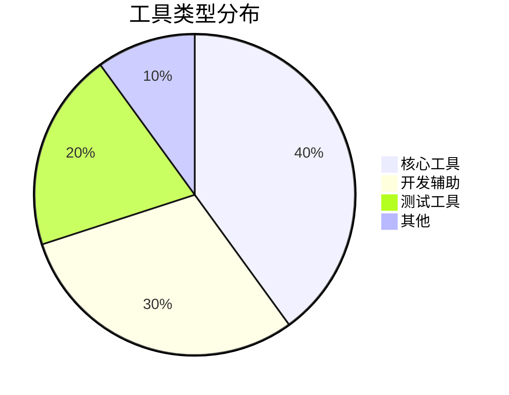
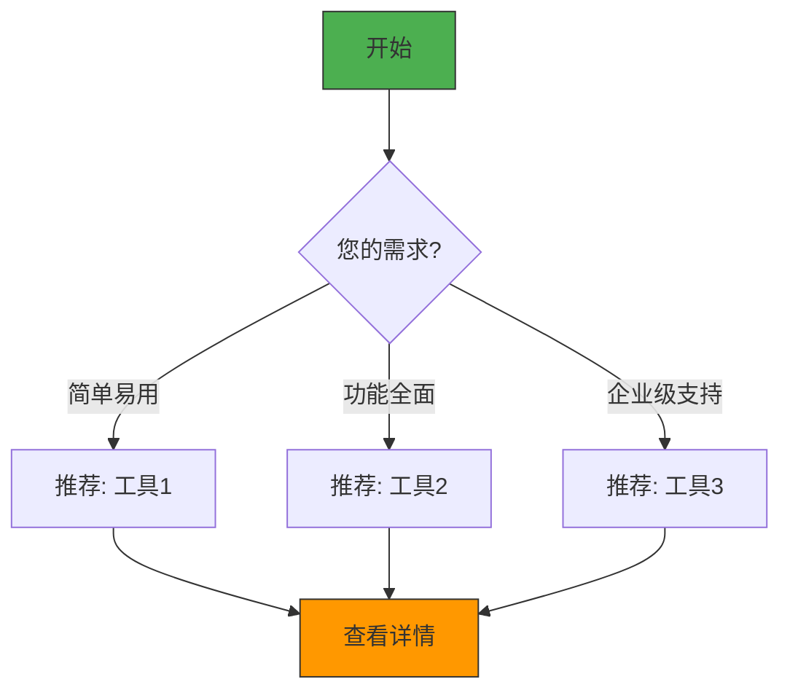
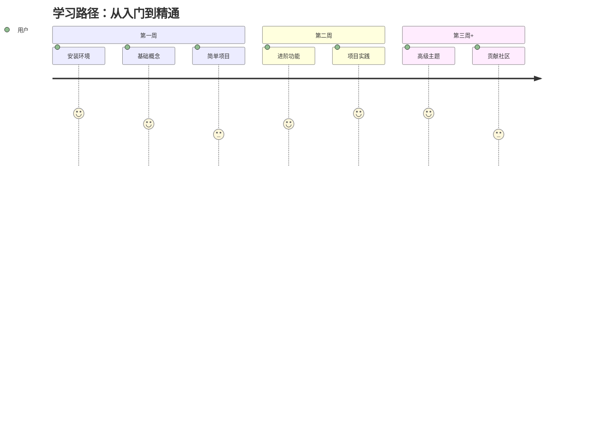
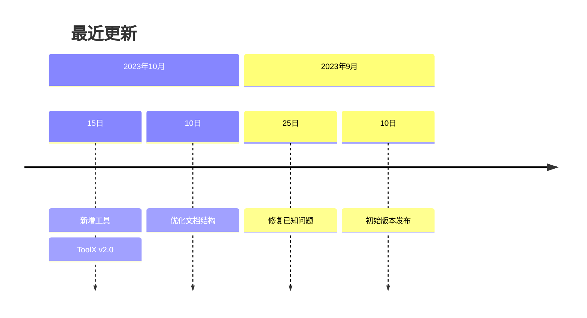

# [分类名称] 工具集

> 最后更新: {{UPDATE_DATE}}

```mermaid
graph TD
    A[{{分类名称}}] --> B[核心工具]
    A --> C[进阶工具]
    A --> D[辅助工具]
    B --> E[{{工具1}}]
    B --> F[{{工具2}}]
    C --> G[{{工具3}}]
    D --> H[{{工具4}}]
    
    style A fill:#4CAF50,stroke:#333,stroke-width:2px
    style B fill:#2196F3,stroke:#333
    style C fill:#9C27B0,stroke:#333
    style D fill:#FF9800,stroke:#333
```

## 📊 分类概览



## 简介

[分类简介，说明这类工具的主要用途和特点]

### 适用人群
- 👩‍💻 开发人员
- 🎨 设计师
- 📊 数据分析师
- 🔧 运维工程师

### 使用场景
- 🏢 企业开发
- 🏠 个人项目
- 🎓 学习研究
- 🚀 生产环境

## 🛠️ 工具列表

### 核心工具

```mermaid
bar
    title 核心工具流行度
    x-axis 工具
    y-axis 使用率 (%)
    "{{工具1}}" : 75
    "{{工具2}}" : 60
    "{{工具3}}" : 45
```

| 工具 | 简介 | 平台 | 开源 | 价格 | 学习曲线 |
|------|------|------|------|------|----------|
| [工具1](tools/tool1/README.md) | 工具1的详细说明，突出核心功能 |   |  | 免费/付费 | 简单/中等/困难 |
| [工具2](tools/tool2/README.md) | 工具2的详细说明，突出特色功能 |  |  | 付费 | 中等 |

### 进阶工具

| 工具 | 简介 | 最佳适用场景 | 集成 | 文档 |
|------|------|------------|------|------|
| [工具3](tools/tool3/README.md) | 适用于高级用户的工具 | 企业级开发 | 🔄 {{集成1}}<br>🔌 {{集成2}} | [文档](链接) |
| [工具4](tools/tool4/README.md) | 特定场景优化工具 | 性能调优 | 🔄 {{集成1}} | [文档](链接) |

## 🎯 选择指南



### 新手推荐
- **工具1**：
  - ✅ 直观的界面
  - 📚 丰富的学习资源
  - 🆓 免费使用
  - ⏱️ 快速上手

- **工具2**：
  - 🎯 针对新手优化
  - 🆘 活跃的社区支持
  - 🧩 丰富的插件生态

### 专业用户推荐
- **工具3**：
  - 🚀 高性能
  - 🔌 强大的API
  - 🔧 高度可定制
  - 🏢 企业级支持

- **工具4**：
  - 🧠 高级功能
  - 🔄 自动化工作流
  - 📊 详细的分析报告

## 🎭 使用场景

### 场景1：快速原型开发

```mermaid
gantt
    title 原型开发流程
    dateFormat  HH:mm
    section 设计
    界面设计 :a1, 09:00, 1h
    数据建模 :a2, after a1, 2h
    section 开发
    前端实现 :a3, 12:00, 3h
    后端实现 :a4, 12:00, 4h
    section 测试
    功能测试 :a5, 16:00, 1h
    用户反馈 :a6, 17:00, 1h
```


**适用工具**：
- 🛠️ 工具1：快速搭建基础框架
- 🎨 工具2：设计用户界面
- 🔍 工具3：实时预览

**使用建议**：
- 使用工具1的模板功能快速开始
- 利用工具2的组件库加速开发
- 定期使用工具3进行测试

### 场景2：企业级应用开发
**挑战**：
- 复杂的业务逻辑
- 团队协作需求
- 高性能要求

**解决方案**：
1. 使用工具3进行架构设计
2. 采用工具4进行代码审查
3. 使用工具5进行性能监控

**预期效果**：
- 开发效率提升 40%
- 代码质量提高 35%
- 问题修复时间减少 50%

## 📚 学习路径

### 新手入门 (1-2周)


### 推荐资源

#### 入门教程
| 资源 | 类型 | 难度 | 时长 | 备注 |
|------|------|------|------|------|
| [{{教程1}}](链接) | 🎥 视频 | ⭐ | 2h | 适合完全新手 |
| [{{教程2}}](链接) | 📖 文档 | ⭐⭐ | 1h | 实战导向 |

#### 进阶指南
| 资源 | 类型 | 主题 | 先决条件 |
|------|------|------|----------|
| [{{指南1}}](链接) | 📝 文章 | 高级配置 | 基础使用经验 |
| [{{指南2}}](链接) | 🎓 课程 | 性能优化 | 中级水平 |

#### 社区与支持
- 💬 [官方论坛](链接) - 获取官方支持
- 👥 [Discord 社区](链接) - 实时交流
- 📚 [Stack Overflow 标签](链接) - 技术问答
- 🐞 [GitHub Issues](链接) - 报告问题

## ❓ 常见问题

### 安装问题
<details>
<summary>❓ 安装时出现依赖错误？</summary>

**可能原因**：
1. 系统环境不满足要求
2. 网络问题导致依赖下载失败
3. 权限不足

**解决方案**：
```bash
# 更新包管理器
brew update  # 或 apt-get update

# 安装依赖
brew install [依赖包]

# 使用管理员权限
sudo [命令]
```
</details>

### 使用问题
<details>
<summary>❓ 如何提高性能？</summary>

**优化建议**：
1. 启用缓存
2. 减少插件数量
3. 调整内存配置

**配置示例**：
```javascript
// config.js
module.exports = {
  performance: {
    cache: true,
    workers: 4,
    memoryLimit: '2g'
  }
}
```
</details>

## 📜 更新日志



### 详细变更

#### 2023-10-15
**新增**
- ✨ [ToolX](tools/toolx/README.md) v2.0 发布
  - 新增功能 A
  - 优化性能 B
  - 修复问题 #123

**改进**
- 💄 更新界面样式
- 🚀 提升启动速度 30%
- 📚 完善文档

#### 2023-10-01
- 🎉 初始版本发布
