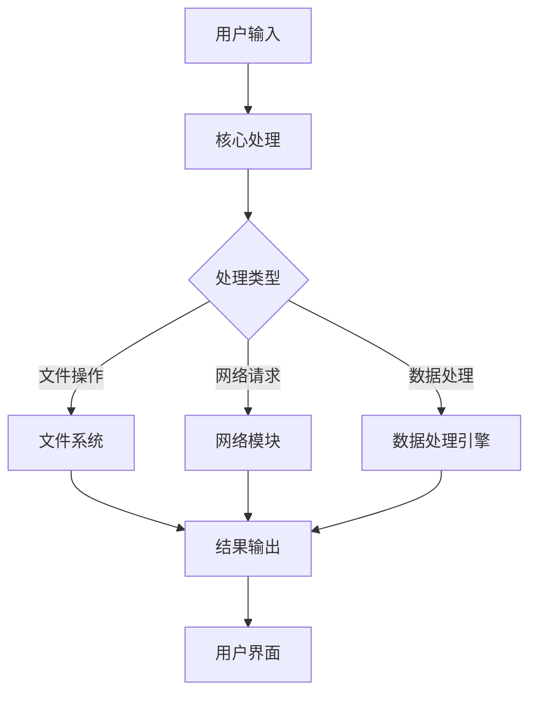
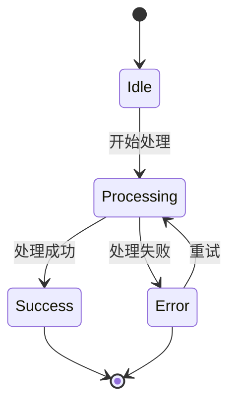
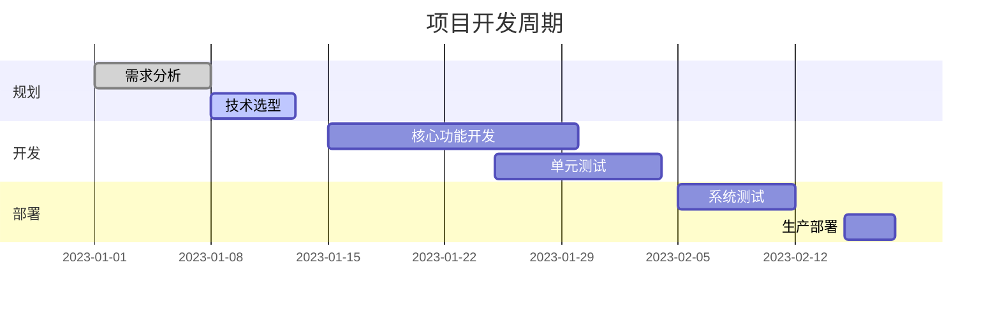
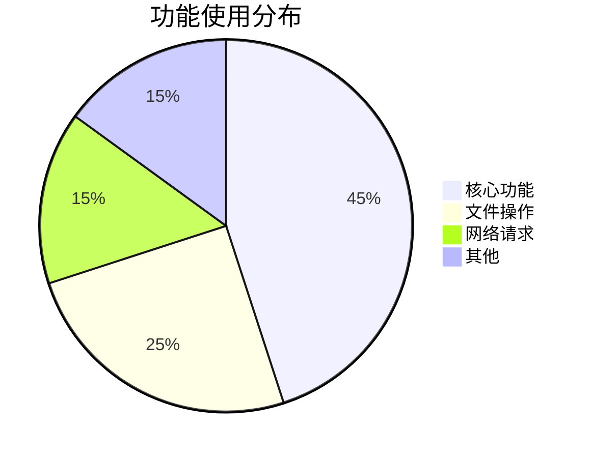

# [工具名称]

## 简介

[工具简介，1-2段话说明工具的主要功能和用途]

## 功能特点

- 功能点1
- 功能点2
- 功能点3

## 安装指南

### 系统要求
- 操作系统：Windows 10+/macOS 10.15+/Linux
- 内存：4GB RAM (推荐8GB+)
- 存储：500MB 可用空间

### Windows
```powershell
# 使用 Chocolatey 安装
choco install toolname

# 或者下载安装包
# 1. 访问 [官网下载页面](https://example.com/download)
# 2. 运行安装程序并按照提示完成安装
```

### Mac
```bash
# 使用 Homebrew 安装
brew install --cask toolname

# 或者下载 DMG 安装包
# 1. 访问 [官网下载页面](https://example.com/download)
# 2. 打开 DMG 文件并将应用拖到 Applications 文件夹
```

### Linux
```bash
# Debian/Ubuntu
sudo apt-get update
sudo apt-get install toolname

# RHEL/CentOS
sudo yum install toolname

# 或者使用 Snap
sudo snap install toolname
```

## 快速开始

### 基本使用
1. 启动应用
2. 创建新项目
3. 开始使用

### 配置文件示例
```yaml
# 配置文件示例
settings:
  theme: dark
  autoUpdate: true
  plugins:
    - plugin1
    - plugin2
```

## 快捷键参考

### 通用快捷键
| 操作 | Windows 快捷键 | Mac 快捷键 | 说明 |
|------|--------------|-----------|------|
| 新建文件 | `Ctrl + N` | `⌘ + N` | 创建新文件 |
| 打开文件 | `Ctrl + O` | `⌘ + O` | 打开现有文件 |
| 保存 | `Ctrl + S` | `⌘ + S` | 保存当前文件 |
| 撤销 | `Ctrl + Z` | `⌘ + Z` | 撤销上一步操作 |
| 重做 | `Ctrl + Y` | `⇧ + ⌘ + Z` | 重做上一步操作 |

### 编辑快捷键
| 操作 | 快捷键 | 说明 |
|------|--------|------|
| 复制 | `Ctrl + C` / `⌘ + C` | 复制选中内容 |
| 剪切 | `Ctrl + X` / `⌘ + X` | 剪切选中内容 |
| 粘贴 | `Ctrl + V` / `⌘ + V` | 粘贴剪贴板内容 |
| 全选 | `Ctrl + A` / `⌘ + A` | 选择所有内容 |
| 查找 | `Ctrl + F` / `⌘ + F` | 查找文本 |
| 替换 | `Ctrl + H` / `⌥ + ⌘ + F` | 查找并替换文本 |

## 架构与工作流程

### 系统架构



### 数据流程图


### 状态图示例



## 使用场景

### 典型工作流



## 高级功能

### 功能1：自定义主题
详细说明如何使用和自定义主题...

### 功能2：插件系统
1. 安装插件
2. 配置插件
3. 使用插件功能

### 功能3：集成开发
```python
# 示例代码
import toolname

def main():
    # 初始化
    tool = toolname.initialize()
    
    # 执行操作
    result = tool.do_something()
    print(f"Result: {result}")

if __name__ == "__main__":
    main()
```

## 使用技巧

### 技巧1：提高效率
详细说明使用技巧...

### 技巧2：调试技巧
```bash
# 启用详细日志
toolname --verbose --log-level=debug
```

### 技巧3：自定义配置
```json
{
  "editor.fontSize": 14,
  "editor.theme": "dark",
  "files.autoSave": "afterDelay"
}
```

## 常见问题

### 问题1：安装失败
**问题描述**：安装过程中出现错误信息

**解决方案**：
1. 检查系统要求是否满足
2. 确保有足够的磁盘空间
3. 以管理员权限运行安装程序
4. 查看日志文件获取详细信息

### 问题2：性能问题
**问题描述**：应用运行缓慢

**解决方案**：
1. 关闭不必要的插件
2. 增加内存分配
3. 更新到最新版本

## 性能指标

### 性能对比

```mermaid
bar
    title 性能对比 (越高越好)
    x-axis 工具
    y-axis 性能分 (1-10)
    "工具A" : 8
    "工具B" : 6
    "工具C" : 9
    "本工具" : 12
```

### 使用统计



## 相关资源

### 官方资源
- [官方文档](https://example.com/docs)
- [API 参考](https://example.com/api)
- [GitHub 仓库](https://github.com/example/toolname)

### 学习资源
- [入门教程](https://example.com/tutorials)
- [示例项目](https://github.com/example/toolname-examples)
- [社区论坛](https://example.com/community) - 报告问题和贡献代码
- [官方文档](https://docs.example.com) - 完整的使用文档
- [社区论坛](https://community.example.com) - 获取帮助和分享经验
- [YouTube 教程](https://youtube.com/example) - 视频教程和演示

## 更新日志

### 2.0.0 (2023-06-15)
- 新增功能 X
- 改进性能
- 修复了若干 bug

### 1.2.0 (2023-03-10)
- 新增插件系统
- 改进用户界面
- 优化了启动时间

### 1.1.0 (2023-02-01)
- 添加了暗黑模式
- 修复了保存问题
- 改进了稳定性

### 1.0.0 (2023-01-01)
- 初始版本发布
