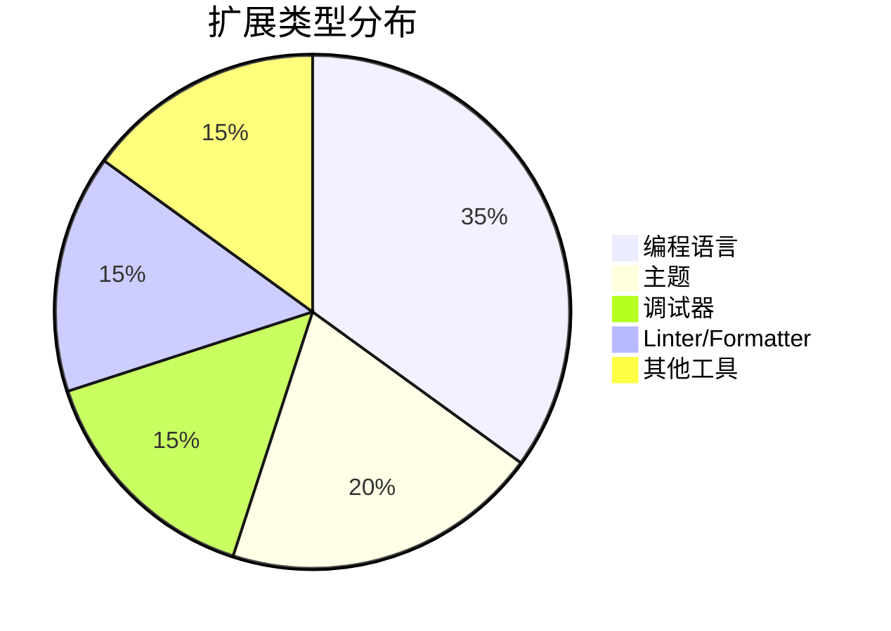

# Visual Studio Code

> 一个轻量级但功能强大的源代码编辑器，支持多种编程语言和开发工作流

## 基本信息

| 项目 | 详情 |
|------|------|
| **官方网站** | [code.visualstudio.com](https://code.visualstudio.com/) |
| **开源协议** | MIT |
| **最新版本** | 1.82.0 (2023-09-07) |
| **适用平台** | Windows, macOS, Linux |
| **价格** | 免费 |
| **分类** | [开发工具](/docs/categories/development.md) / [代码编辑器](#) |

## 功能特点


- **智能代码补全**：基于变量类型、函数定义和导入的模块提供智能补全
- **内置 Git 支持**：直接在编辑器中管理 Git 仓库，查看差异、暂存更改和提交
- **调试工具**：内置调试支持，支持 Node.js、Python、C++ 等多种语言
- **扩展市场**：丰富的扩展生态系统，可添加新语言、主题、调试器等
- **终端集成**：内置终端，支持 PowerShell、Command Prompt、Bash 等
- **可定制**：通过设置、键盘快捷方式和扩展进行高度定制
- **多光标**：同时编辑多个位置的代码，提高编码效率

## 工作流程


## 安装指南

### 系统要求

- **操作系统**：Windows 8.0+、macOS 10.11+ 或 Linux（64 位）
- **内存**：建议 2GB 以上
- **存储空间**：200MB 可用空间

### 安装步骤

#### Windows

1. 下载安装程序：
   ```powershell
   winget install -e --id Microsoft.VisualStudioCode
   ```
   或从[官网](https://code.visualstudio.com/download)下载

2. 运行安装程序并按照提示完成安装

3. 可选：将 VS Code 添加到 PATH
   - 打开命令面板（`Ctrl+Shift+P`）
   - 输入 "shell command" 并选择 "Shell Command: Install 'code' command in PATH"

#### macOS

1. 使用 Homebrew 安装：
   ```bash
   brew install --cask visual-studio-code
   ```
   或从[官网](https://code.visualstudio.com/download)下载 .dmg 文件

2. 将 VS Code 拖到 Applications 文件夹

3. 可选：从终端启动 VS Code
   - 打开命令面板（`Cmd+Shift+P`）
   - 输入 "shell command" 并选择 "Shell Command: Install 'code' command in PATH"

#### Linux

##### Debian/Ubuntu

```bash
sudo apt update
sudo apt install -y wget gpg
gpg --no-default-keyring --keyring /usr/share/keyrings/microsoft-vscode.gpg --keyserver https://packages.microsoft.com/keys/microsoft.asc --import
wget -qO- https://packages.microsoft.com/keys/microsoft.asc | gpg --dearmor > packages.microsoft.gpg
sudo install -D -o root -g root -m 644 packages.microsoft.gpg /usr/share/keyrings/
sudo sh -c 'echo "deb [arch=amd64,arm64,armhf signed-by=/usr/share/keyrings/microsoft-vscode.gpg] https://packages.microsoft.com/repos/code stable main" > /etc/apt/sources.list.d/vscode.list'
rm -f packages.microsoft.gpg
sudo apt update
sudo apt install -y code # 或 code-insiders
```

##### Arch Linux

```bash
sudo pacman -S code  # 或 code-git (AUR)
```

## 快速入门

### 基本命令

```bash
# 打开当前目录
code .

# 打开特定文件或文件夹
code path/to/file.txt
code path/to/folder

# 比较两个文件
diff file1.js file2.js

# 以管理员身份打开
code . --user-data-dir='~/.vscode-root'
```

### 常用快捷键

#### 通用

| 快捷键 | 描述 |
|--------|------|
| `Ctrl+P` | 快速打开文件 |
| `Ctrl+Shift+P` | 命令面板 |
| `Ctrl+Shift+X` | 扩展视图 |
| `Ctrl+B` | 切换侧边栏可见性 |
| `Ctrl+J` | 切换终端 |
| `Ctrl+\` | 拆分编辑器 |

#### 编辑

| 快捷键 | 描述 |
|--------|------|
| `Ctrl+X` | 剪切行 |
| `Ctrl+C` | 复制行 |
| `Alt+↑/↓` | 上下移动行 |
| `Shift+Alt+↑/↓` | 向上/下复制行 |
| `Ctrl+/` | 切换行注释 |
| `Shift+Alt+A` | 切换块注释 |
| `F12` | 跳转到定义 |
| `Alt+F12` | 查看定义 |
| `Ctrl+K F12` | 在侧边打开定义 |
| `Shift+F12` | 显示引用 |
| `F2` | 重命名符号 |

#### 多光标

| 快捷键 | 描述 |
|--------|------|
| `Alt+Click` | 插入光标 |
| `Ctrl+Alt+↑/↓` | 在上/下插入光标 |
| `Ctrl+U` | 撤销上一个光标操作 |
| `Shift+Alt+I` | 在选区的每一行末尾插入光标 |

## 扩展生态系统

### 扩展使用统计



## 扩展推荐

### 通用扩展

| 扩展 | 描述 |
|------|------|
| [Prettier](https://marketplace.visualstudio.com/items?itemName=esbenp.prettier-vscode) | 代码格式化工具 |
| [ESLint](https://marketplace.visualstudio.com/items?itemName=dbaeumer.vscode-eslint) | JavaScript/TypeScript 代码检查 |
| [GitLens](https://marketplace.visualstudio.com/items?itemName=eamodio.gitlens) | Git 增强功能 |
| [Path Intellisense](https://marketplace.visualstudio.com/items?itemName=christian-kohler.path-intellisense) | 路径自动补全 |
| [Bracket Pair Colorizer](https://marketplace.visualstudio.com/items?itemName=CoenraadS.bracket-pair-colorizer) | 为匹配的括号着色 |
| [Auto Rename Tag](https://marketplace.visualstudio.com/items?itemName=formulahendry.auto-rename-tag) | 自动重命名配对的 HTML/XML 标签 |

### 语言支持

| 扩展 | 语言 |
|------|------|
| [Python](https://marketplace.visualstudio.com/items?itemName=ms-python.python) | Python 语言支持 |
| [Java Extension Pack](https://marketplace.visualstudio.com/items?itemName=vscjava.vscode-java-pack) | Java 开发工具包 |
| [C/C++](https://marketplace.visualstudio.com/items?itemName=ms-vscode.cpptools) | C/C++ 支持 |
| [Go](https://marketplace.visualstudio.com/items?itemName=golang.Go) | Go 语言支持 |
| [Rust](https://marketplace.visualstudio.com/items?itemName=rust-lang.rust) | Rust 语言支持 |

## 性能优化

### 资源使用情况


## 自定义设置

### 用户设置示例

```json
{
  "editor.fontSize": 14,
  "editor.tabSize": 2,
  "editor.wordWrap": "on",
  "editor.formatOnSave": true,
  "editor.defaultFormatter": "esbenp.prettier-vscode",
  "files.autoSave": "afterDelay",
  "workbench.colorTheme": "One Dark Pro",
  "workbench.iconTheme": "material-icon-theme",
  "terminal.integrated.fontSize": 13,
  "emmet.includeLanguages": {
    "javascript": "javascriptreact",
    "vue-html": "html",
    "razor": "html",
    "plaintext": "jade"
  },
  "javascript.updateImportsOnFileMove.enabled": "always",
  "typescript.updateImportsOnFileMove.enabled": "always",
  "explorer.confirmDelete": false,
  "explorer.confirmDragAndDrop": false,
  "git.enableSmartCommit": true,
  "git.autofetch": true,
  "git.confirmSync": false,
  "window.zoomLevel": 0
}
```

### 键盘快捷键

```json
[
  {
    "key": "ctrl+shift+u",
    "command": "editor.action.transformToUppercase",
    "when": "editorTextFocus"
  },
  {
    "key": "ctrl+shift+l",
    "command": "editor.action.transformToLowercase",
    "when": "editorTextFocus"
  },
  {
    "key": "ctrl+shift+p",
    "command": "editor.action.formatDocument",
    "when": "editorTextFocus"
  }
]
```

## 开发工作流

### 典型开发流程


## 集成终端

### 配置

```json
{
  "terminal.integrated.fontFamily": "'Fira Code', 'Droid Sans Mono', 'Courier New', monospace",
  "terminal.integrated.fontSize": 14,
  "terminal.integrated.cursorStyle": "line",
  "terminal.integrated.cursorBlinking": true,
  "terminal.integrated.scrollback": 10000,
  "terminal.integrated.defaultProfile.windows": "PowerShell",
  "terminal.integrated.profiles.windows": {
    "PowerShell": {
      "source": "PowerShell",
      "icon": "terminal-powershell"
    },
    "Command Prompt": {
      "path": "cmd.exe",
      "args": []
    },
    "Git Bash": {
      "source": "Git Bash"
    }
  }
}
```

## 调试体验

### 调试流程


## 调试配置

### 调试 Node.js 应用

```json
{
  "version": "0.2.0",
  "configurations": [
    {
      "type": "node",
      "request": "launch",
      "name": "Launch Program",
      "skipFiles": ["<node_internals>/**"],
      "program": "${workspaceFolder}/app.js"
    }
  ]
}
```

### 调试 Python 应用

```json
{
  "version": "0.2.0",
  "configurations": [
    {
      "name": "Python: Current File",
      "type": "python",
      "request": "launch",
      "program": "${file}",
      "console": "integratedTerminal",
      "justMyCode": true
    }
  ]
}
```

## 性能对比

```mermaid
bar
    title 编辑器启动时间比较 (ms)
    x-axis 编辑器
    y-axis 时间 (ms)
    "VS Code" : 1200
    "Sublime Text" : 800
    "Atom" : 3500
    "WebStorm" : 4500
```

## 常见问题解答

### Q: 如何重置 VS Code 设置？
A: 删除以下目录：
- Windows: `%APPDATA%\\Code\\User\\settings.json`
- macOS: `~/Library/Application Support/Code/User/settings.json`
- Linux: `~/.config/Code/User/settings.json`

### Q: 如何禁用扩展？
A: 打开扩展视图（`Ctrl+Shift+X`），找到扩展，点击齿轮图标选择"禁用"或"卸载"。

### Q: 如何查看命令面板中的所有命令？
A: 按 `F1` 或 `Ctrl+Shift+P` 打开命令面板，输入 `?` 查看所有可用命令。

### Q: 如何更改主题？
A: 按 `Ctrl+K Ctrl+T` 打开主题选择器，或通过设置 `workbench.colorTheme` 更改。

## 相关资源

- [官方文档](https://code.visualstudio.com/docs)
- [API 参考](https://code.visualstudio.com/api)
- [扩展 API](https://code.visualstudio.com/api/references/vscode-api)
- [扩展市场](https://marketplace.visualstudio.com/vscode)
- [GitHub 仓库](https://github.com/microsoft/vscode)
- [发行说明](https://code.visualstudio.com/updates/)

## 许可证

Visual Studio Code 采用 [MIT 许可证](https://github.com/microsoft/vscode/blob/main/LICENSE.txt) 发布。

## 更新日志

### 1.82.0 (2023-09-07)
- 新增：终端配置文件 API
- 改进：文件资源管理器中的拖放功能
- 修复：Git 集成中的多个问题

### 1.81.0 (2023-08-03)
- 新增：内联提示功能
- 改进：终端性能优化
- 修复：扩展主机崩溃问题
